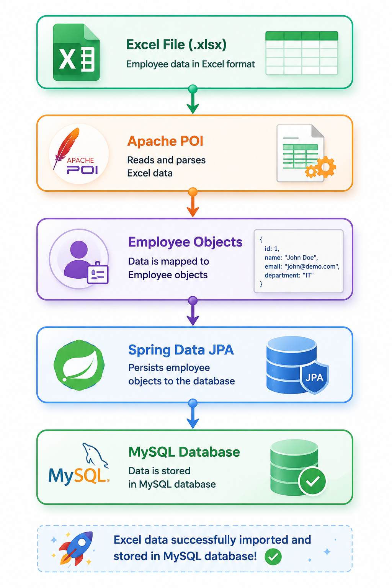
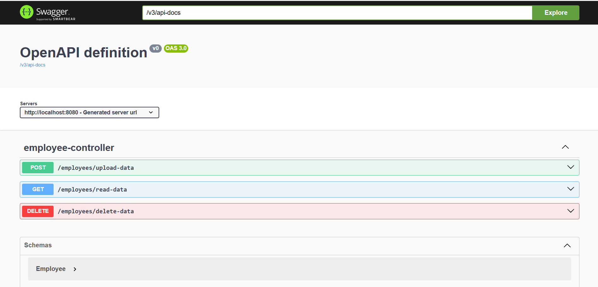

# 📊 Spring Boot: Excel to Database

A Spring Boot REST API application that reads employee data from an Excel file and stores it in a MySQL database using Apache POI. The application provides APIs to upload Excel data, retrieve stored records, and delete records from the database.

---
## ⚙️ What This Covers

✔ Upload employee data from Excel files

✔ Store records in MySQL database

✔ Fetch all employee records

✔ Delete all employee records

✔ Interactive Swagger UI documentation

✔ Clean layered architecture (Controller → Service → Repository)

---

## 🛠️ Tech Stack

| Category             | Technologies                          |
| -------------------- | ------------------------------------- |
| **Backend**          | Java 17, Spring Boot, Spring Data JPA |
| **Database**         | MySQL                                 |
| **Excel Processing** | Apache POI                            |
| **Documentation**    | Swagger / OpenAPI 3                   |
| **Build Tool**       | Maven                                 |

---

## 📡 REST API Endpoints

| Method | Endpoint | Description |
|---------|-----------|-------------|
| POST | `/employees/upload-data` | Uploads an Excel file and stores employee records in MySQL database |
| GET | `/employees/read-data` | Retrieves all employee records from the database |
| DELETE | `/employees/delete-data` | Deletes all employee records from the database |

---

## 🚀 How it Works

  

---

## 📸 Output

  

---

## 🎯 Conclusion

👉 *This repository demonstrates how to upload Excel files, process data using Apache POI, and persist records into a MySQL database using Spring Boot and Spring Data JPA. It provides a practical example of file handling, REST API development, database integration, and API documentation with Swagger/OpenAPI.*

---

⭐ Thank You for Visiting This Repository ⭐

